## 超音波画像を用いた<br>肝脂肪の定量化

<br><br>
<font size="6" color="gray">2018.02.24 SappoRoR#8 </font>

Note:
本日は超音波画像を用いた肝脂肪の定量化についておはなしします。

---
### 本日の内容

1. 自己紹介 
2. 非アルコール性脂肪性肝疾患(NAFLD)について
3. NAFLDの画像検査
4. 肝脂肪定量化shinyアプリ
5. 私流shinyアプリの作成法
6. まとめ

---
### 自己紹介

  
@R_beginner<Br><Br>


仕事：👨🏻‍⚕️内科開業医 <Br>（肝臓病、消化器病）<Br>
趣味：ランニング/PC自作<Br>R/Bash/Python/JS<Br><Br>

---
### 脂肪肝の定量化

Note:
まず脂肪肝についての一般的な内容をお話します。

---
### 脂肪肝のカテゴリー

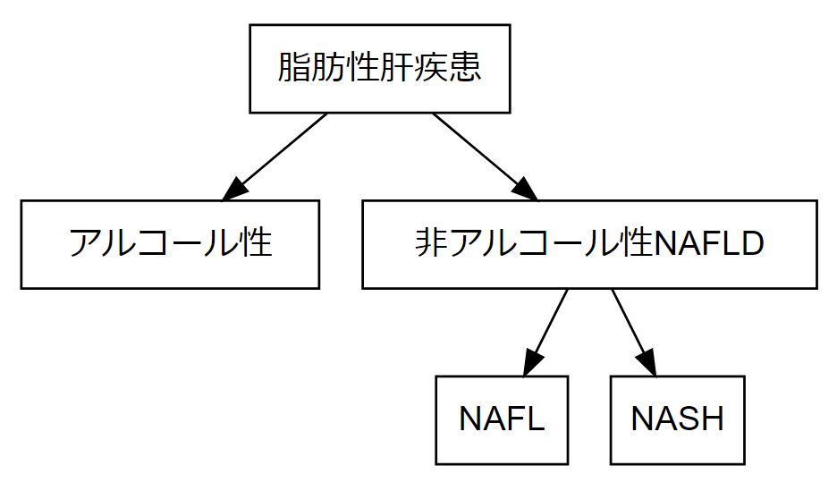  

Note:
脂肪肝は、まずアルコール性の肝障害とそれ以外に大きくわけられます。アルコール性は肝硬変にいたる疾患群として以前より認知されておりましたが、非アルコール性肝疾患も、一部の群で肝炎から肝硬変、肝発癌に至るNASHと呼ばれる疾患が知られるようになりました。

--- 
### 非アルコール性脂肪性肝疾患について

- 飲酒歴がない
- 肝炎ウイルス、自己抗体等陰性
- 画像所見で脂肪肝を認める

+++
### NAFLDの病理画像

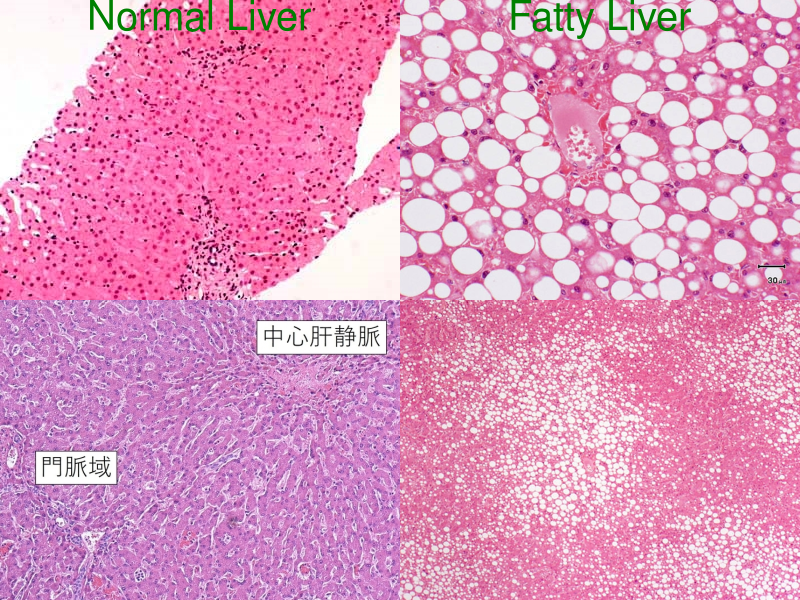  

Note:
NAFLDの病理所見では、左の正常肝細胞に比べ、泡沫状のトリグリセライド蓄積を著明に認めます

+++
### NAFLDの問題点

- NAFLDは８〜２１年の経過観察で、５〜８％<br>の症例が肝硬変へと進展する。
- NASH肝硬変からの肝発癌率は５年で<br>１１．３％、アルコール性肝硬変の発癌率（７．１％）より高い。

+++
### NAFLDから肝硬変へ

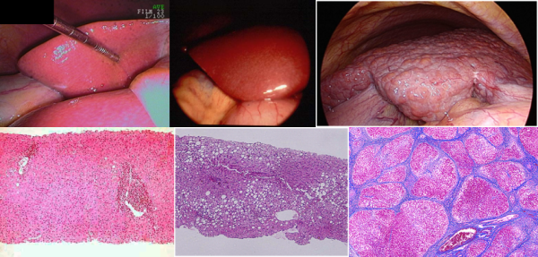  

Note:　
上の段は腹腔鏡所見で、左のほぼ正常肝から、辺縁の鈍化した慢性肝炎像、表面不整な右の肝硬変像
下段は左のほぼ正常病理像から脂肪化した肝組織、右の線維化の進んだ肝組織となっています。

+++
### NAFLD病理所見のポイント

1. 脂肪化（steatosis）
2. 炎症（inflammation）
3. 線維化（firosis）

Note:
病理所見は大きく３つのポイントからなり、おのおのスコアリングシステムでグレード分類を行います。

+++
### 診断方法

- Biopsy
- MRS(magnetic resonance spectroscopy)
- CT
- US(ultrasonography)
- Fibroscan

Note:
診断は上記の方法で行いますが、それぞれに一長一短があります。

+++
### 診断方法の問題点

方法         | 問題点
------------ | -------------
生検　| 検査侵襲、サンプリングエラー
MRI    | 検査が高額、施設が限られる
CT     | 被爆、施設が限られる
US　　| 術者の技量、主観的？
Fibrscan　| 特化した機能の割に高額

Note:
組織検査は、検査侵襲が大きいのと、脂肪化は肝組織内で不均一におこるのでサンプリングエラーの問題が有ります。<br>
MRIは、大掛かりな機械のため施設が限られます、検査費用も高めです。<br>
CTは、被爆の問題があります。<br>
USは、術者の技量で診断にばらつきが起こりやすく、定量的に判断するのは難しい。<br>
Fibroscanは、線維化、脂肪化ともに定量化できるが、機能特化している装置のため導入施設が少ないという問題あります。

+++
### USのメリット、デメリット

メリット         | デメリット
------------ | -------------
検査侵襲が無い | 術者の技量が影響
どこの施設にもある  |定性的？　

<br><font size="5" color="gray">炎症、線維化を起こす前の脂肪化を定量化できれば、食事療法、内服等治療介入しやすくなる。</font> 

+++
### 脂肪肝のUS所見

- **肝腎コントラスト**　
- 脈管の不明瞭化
- 深部エコー減衰

Note:
脂肪肝のUS所見は、大きく３つ。脂肪化の程度により出現する所見が変わってきます、肝腎コントラストは比較的早期から、脂肪化の程度がすすむと、脈管不明瞭化、深部エコー減衰の所見も現れてきます。

+++
### 肝腎コントラスト

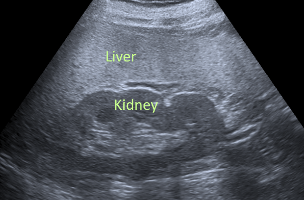  
肝臓と腎臓の明るさの違いを定量化していく

Note:
今回は、この肝腎コントラストを画像から定量化する試みです。

---
### shinyアプリの作成

- データの処理部分のみRで動作確認 |
- shinyのUI部分作成、server部分は空のまま |
- sever部分の実装 |

+++
### 今回のアプリの概要

1. 画像ファイル読み込み
2. OCRで患者情報抽出
3. ROI部分を画像抜き出し
4. グレイスケール化
5. 肝腎輝度比の計算
6. データの書き出し

+++
### 手書きUI

  

Note:
こんな感じで下書きしてます。

+++
### 画像読み込みとOCR

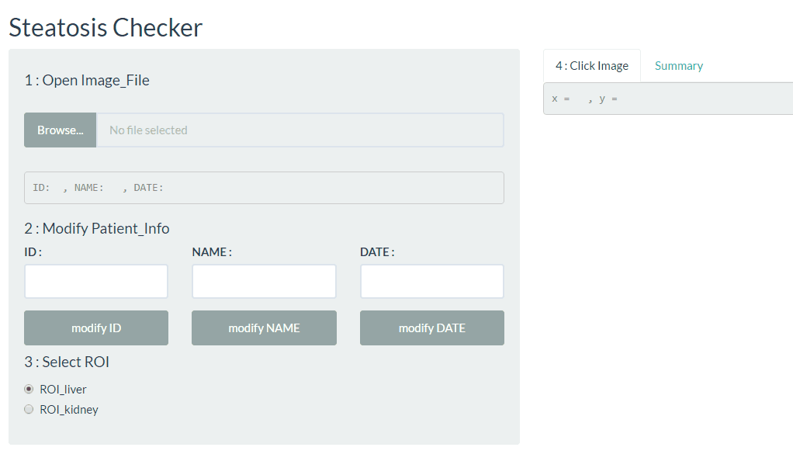  

+++
### ファイル読み込みコード

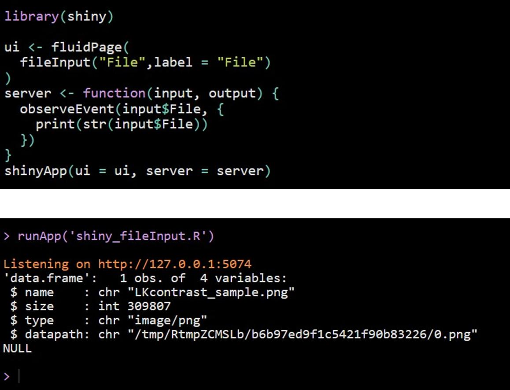  

+++
### OCRコード

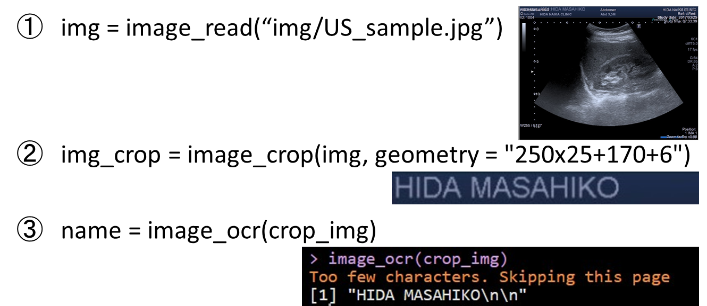  

+++
### 患者情報修正

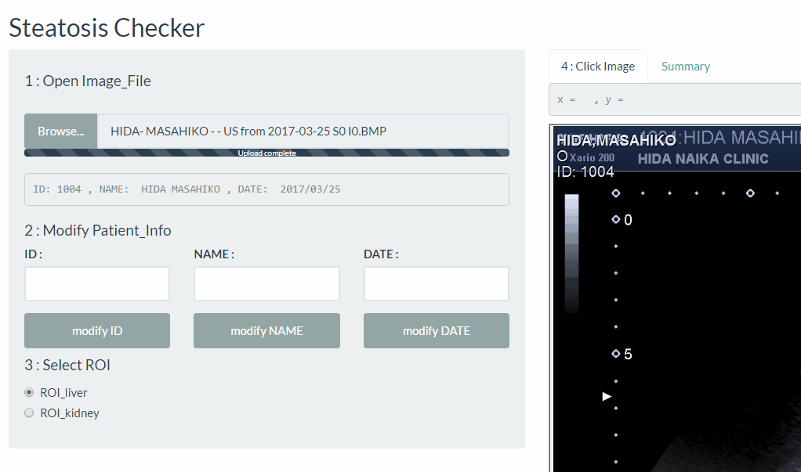  

+++
### ROI部分を画像抜き出し

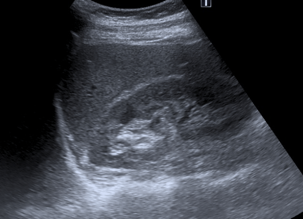  

+++
### データの書き出し

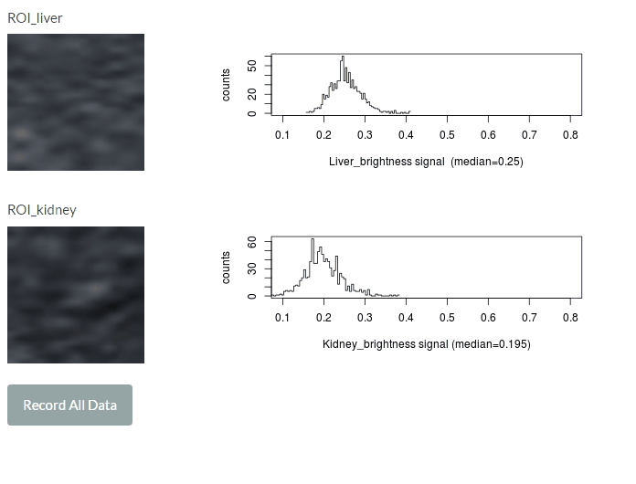  

---
### 肝脂肪定量化shinyアプリ

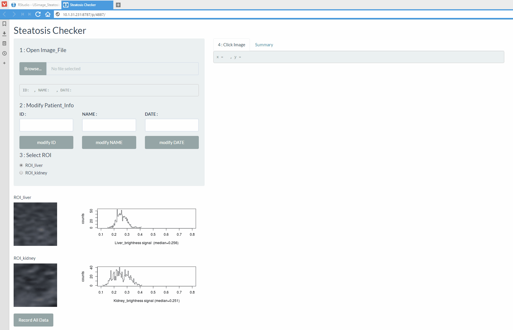   

--- 
### 対象、方法

- ２０１４年４月から当院で腹部超音波検査を行った、２００例
- 機器は東芝製（Xario200）を使用
- 肝腎コントラストが比較的中心で描出され、アーチファクトの影響の少ない画像を使用

+++
### 結果

ヒストグラムの画像

+++
### 考察

肝腎コントラストによる肝脂肪定量化は、簡便であり低コストで十分実用に耐えうると考えられる。


---
### 後半

shinyアプリのはなし

---
### shinyアプリ作成で困ること

1. render関数が覚えられない
2. **コードが長くて、読みにくい**
3. たまに変数に代入が上手くいかない
4. エラーの原因がわかりにくい…

---
### コードが長くて、読みにくい<br>
　　（アン・リーダブルコード問題？）

+++
### shinyコードは長い

- UI部分のコード |
- SERVER部分には、イベントやレンダリング関数 |
- さらに実際の内容に関する変数やメソッド | 

+++
### コードの可読性を上げる

- はじめてのクラス作成 |

+++
### Ｒのクラス

- S3
- S4
- 参照クラス 
- R6  

+++
### 参照クラス

- Package入れなくても使える
- 多重継承できる

+++
### 参照クラスの定義

- クラス名
- フィールド
- メソッド

+++
###  参照クラス(RC)のサンプル

```
Person <- setRefClass(
  Class = "Person",       # クラス名
  fields = list (          # フィールド
    name     = "character"　　    # 名前
  ),
  methods = list (         # メソッド
    getName = function() {
      print(.self$name)　　　　　　　　　　　　　　　　# 患者名を出力する
    }
  ))
```
@[2](クラス名を定義)
@[3-5](フィールドを定義)
@[6-9](メソッドを定義)

+++
### RCの継承サンプル

```
Patient = setRefClass("Patient",
                      contains = c("Person", "Clinic")
)
```
@[2](containsでクラス継承)

---
### 今回作成した参照クラス

+++
### MedicalImageInfo class

```
MedicalImageInfo = setRefClass("MedicalImageInfo",
                               fields = list(
                                 path = "character",
                                 id = "character",
                                 name = "character",
                                 date = "character"
                               ),
                               methods = list(
                                 initialize = function(path = "", id = "", name = "", date = ""){
                                   .self$path = path
                                   .self$id = id
                                   .self$name = name
                                   .self$date = date
                                 } 
                               ))
```
@[9](initializeは初期化メソッド)


+++
### OCR class

```
OCR = setRefClass("OCR",
                  methods = list(
                    extract_data = function(path, geometory){
                      img = image_read(path)
                      image_ocr(image_crop(img, geometry = geometory))
                    } 
                  ))
```
+++
### PatientInfoExtractor class

```
PatientInfoExtractor = setRefClass("PatientInfoExtractor",
                                   contains = c("OCR", "MedicalImageInfo"),
                                   fields = list(
                                     id_geometory = "character",
                                     name_geometory = "character",
                                     
                                     date_geometory = "character"
                                   ), 
                                   methods = list(
                                     extract_id = function(path){
                                       id_tmp = .self$extract_data(path, .self$id_geometory)
                                       substr(id_tmp, 1, (nchar(id_tmp) - 2)) # return(id)
                                     }, 
                                     extract_name = function(path){
                                       name_tmp = .self$extract_data(path, .self$name_geometory)
                                       substr(name_tmp, 1, (nchar(name_tmp) - 2)) # return(name)
                                     }, 
                                     extract_date = function(path){
                                       date_tmp = .self$extract_data(path, .self$date_geometory)
                                       substr(date_tmp, 1, (nchar(date_tmp) - 2)) # return(date_tmp)
                                     } 
                                   ))
```
<font size="5" color="gray">これで、エコー画像も内視鏡画像も<br>OCRが使えるクラスが出来ました。</font>

+++
### US用の参照クラス

```
Xario200 = setRefClass("Xario200",
                       contains = c("PatientInfoExtractor"),
                       methods = list(
                         initialize = function(id = "0902",
                                               name = "sapporo taro",
                                               date = "2010-12-01",
                                               id_geometory = "70x25+35+50",
                                               name_geometory = "250x25+170+6",
                                               date_geometory = "105x22+840+50"){
                           .self$id = id
                           .self$name = name
                           .self$date = date
                           .self$id_geometory = id_geometory
                           .self$name_geometory = name_geometory
                           .self$date_geometory = date_geometory
                         } 
                       ))
```
<font size="5" color="gray">患者情報の座標が入ったUS用クラス</font>

+++
### クラス図

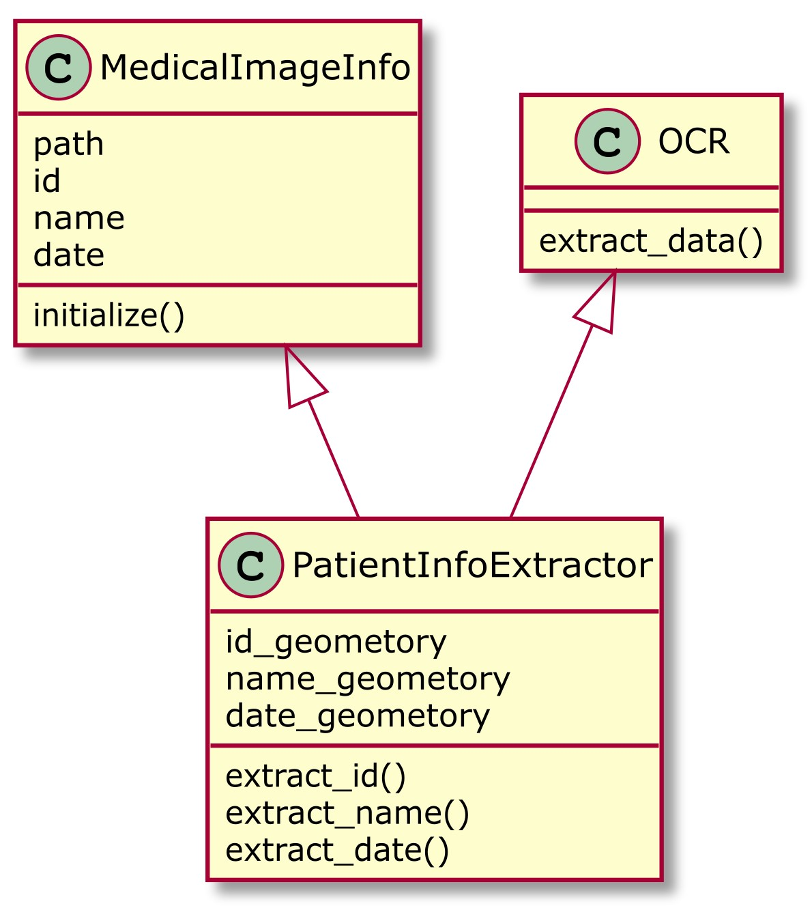   

+++
### クラスのインスタンス化

```
> xario = PatientInfoExtractor$new()
> xario$getClass()
Reference Class "PatientInfoExtractor":

Class fields:
                                                                                 
Name:            path             id           name           date   id_geometory
Class:      character      character      character      character      character
                                    
Name:  name_geometory date_geometory
Class:      character      character

Class Methods: 
     "extract_date", "extract_name", "extract_id", "extract_data", "import", 
     ".objectParent", "usingMethods", "show", "getClass", "untrace", "export", 
     ".objectPackage", "callSuper", "copy", "initFields", "getRefClass", "trace", "field", 
     "initialize"

Reference Superclasses: 
     "OCR", "MedicalImageInfo", "envRefClass"

```
@[1](クラスのインスタンス化)
@[2](クラスの内容を確認)
@[5-11](インスタンスの変数)
@[13-14](インスタンスのメソッド)
@[19-20](スーパークラス)

+++
### 実際のshiny code

```
library(shiny)

source("EstimateLiverSteatosis_RefClass.R")
xario = Xario200$new()

ui <- fluidPage(
  textInput("tempId", label = "ID : "),
  actionButton("modify_id_btn", "modify ID")
)
server <- function(input, output) {
  observeEvent(input$modify_id_btn, {
    xario$id = input$tempId
  }) 
}
shinyApp(ui = ui, server = server)
```
@[3-4](外部のクラスファイルを読み込んで、インスタンス化)
@[7-8](テキスト入力欄とアクションボタン)
@[11-13](ボタンを押したら、IDを保存)


---
### 後半のまとめ

- 参照クラスでコードがリーダブル
- クラスを再利用して、開発の効率化


